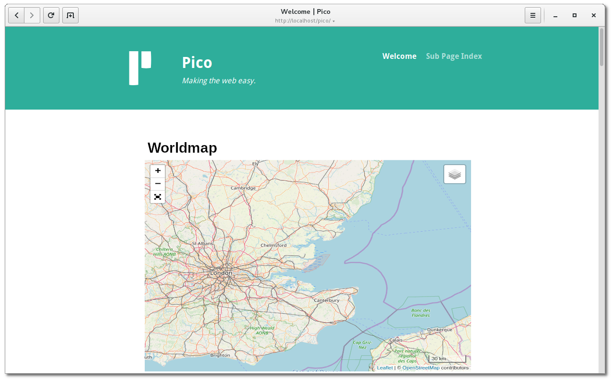

# PicoLeaflet

Interactive maps for [Pico CMS](http://picocms.org). This plugin is based on [Leaflet](https://leafletjs.com) the leading open-source JavaScript library for mobile-friendly interactive maps. In addition, markers, waypoints and routes can be easily added.

## Screenshot

## Installation

Copy the files from Github https://github.com/maloja/pico-leaflet into your Pico CMS plugins folder `plugins/PicoLeaflet`.

or clone directly from Github in plugins/PicoLeaflet

	cd plugins
	git clone https://github.com/maloja/pico-leaflet
	
or, if you installed Pico CMS with composer

	composer require maloja/pico-leaflet

## Usage

Add the following expression in your Markdown file. The expression will be replaces by the corresponding map.

	(% map:
		width = 400,
		height = 200,
		center = 0.00000 0.00000,
		zoom= 16,
		marker = 0.00 0.00 Add a text label,
		marker = 0.00 0.00 Add a text label,
		markerfile = "/path/to/the/markerfile.txt",
	    gpxfile = "/path/to/the/trackfile.gpx",
	%)

### Options

- `width = nnn,`: Maximum width of the map. Either a numeric value which means pixels or a percentage value of the page width e.g.50%. If the viewport is smaller than this size, the map will be reduced accordingly. Default is 100%

- `height = nnn,`: Height of the map in pixels. Values less than 1 are treated as a ratio of the card width. e.g. 0.75. Default is 300px.

- `center = lat lon,`: Initial geographic center of the map. Represents a geographical point with a certain latitude and longitude. Default is somewhere in switzerland. 

- `zoom = nn`: Initial map zoom level. The greater the value, the greater the magnification. Default 10

- `marker = lat lon text,`: Places a text marker at the given latitude/longitude position on the map. This line may appear several times for several markings.
 
- `markerfile = "filename"`: For multiple map markers, the markers can also be saved in a text file. The format is the same as for the individual markers. One line for each marker. The markerfile line may appear several times.

- `gpxfile = filename`: Routes can also be shown on the maps. The data must be in GPX v1.0 or GPX v1.1 format. The gpxfile line may appear several times

### Adding a CSS id or class

It is also possible to add a CSS id or class according to the markdown syntax.    
Examples:

~~~
(% map ..... %){#id}
(% map ..... %){.class}
~~~

## Additional Ccmponents

This package contains the following JavaScript components:

| Name                                | Version | URL                                                  |
|------                               |---------|-----                                                 |
| Leaflet                             |  1.6.0  | https://leafletjs.com/                               |
| Leaflet plugin for fullscreen mode  |  1.6.0  | https://github.com/brunob/leaflet.fullscreen         |
| Leaflet plugin for GPX Routes       |  1.5.0  | https://github.com/mpetazzoni/leaflet-gpx            |
| Leaflet plugin for gesture handling |  1.1.8  | https://github.com/elmarquis/Leaflet.GestureHandling |
